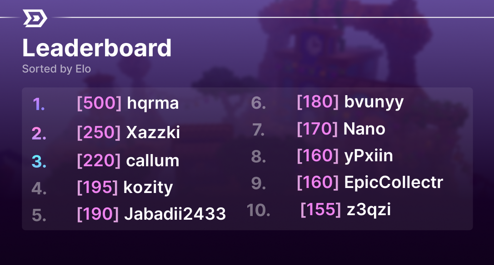
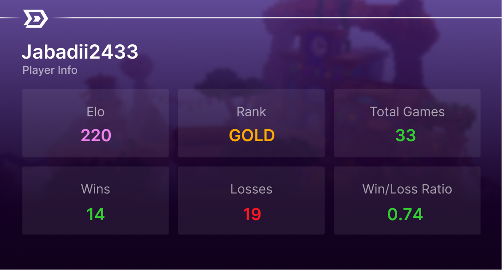

# Dismal Ranked

[](https://github.com/Tsukiatte/dismal-ranked/actions/workflows/ci.yml)
[](https://www.python.org/downloads/release/python-380/)
[](LICENSE)

A competitive matchmaking Discord bot for a Minecraft PvP community. It ran a
full ranked ladder: voice-channel queuing, captain drafting,
screenshot-verified scoring, elo ratings with division roles, a party system
for duo queuing, moderation tooling, and a public REST API that fed the
community website's leaderboard.

Built in 2022; the storage layer was rewritten from flat JSON files to SQLite
in 2026.

| | |
|---|---|
| Registered players | 286 |
| Games run | 254 (200 scored) |
| Player-games recorded | 2,032 |
| Slash commands | 36 |
| Lobby size | 8 players, 2 teams |

## Demo

<!--
  TODO: replace with the YouTube walkthrough.

  Thumbnail-link form (works on GitHub -- embedded <iframe> does not):

  [](https://www.youtube.com/watch?v=VIDEO_ID)

  Worth capturing, in order: joining the queue voice channel, the lobby
  filling and channels being created, a captain running /pick, the teams
  splitting into their voice channels, /score with screenshots, a scorer
  running /submit, and the elo/role updates landing.
-->

*A video walkthrough is coming — for now, the flow below and the screenshots
show how it works.*

## How it works

The bot's core loop is driven entirely by voice state, so players never type a
command to queue.

```
player joins the queue voice channel
        │
        ▼
  queue fills to 8 ─────► unregistered players are ejected
        │
        ▼
  game record created; text + 3 voice channels spun up
        │
        ▼
  two captains named (highest elo); parties pre-seeded onto teams
        │
        ▼
  captains alternate /pick until one player remains ──► auto-assigned
        │
        ▼
  teams moved to their voice channels, match played
        │
        ▼
  /score uploads 3 screenshots ──► scorer reviews ──► /submit
        │
        ▼
  elo applied in one transaction; division roles and nicknames updated
```

Any player can call `/void` to open a vote; five reactions cancels the game
with no rating change.

## Screenshots

Both images are generated at request time with Pillow, composited over a
background template.

**`/leaderboard`** — top 10 by elo



**`/info`** — a player's stat card



## Features

**Ranked play**
- Automatic game creation when the queue voice channel fills
- Captain draft with alternating picks and a double-pick correction when
  party seeding leaves the teams uneven
- Parties (duo queue) are kept on the same team
- Screenshot proof workflow with a dedicated scorer review channel
- Community voting to void a broken game

**Ratings**
- Compressive elo: low ratings gain more and lose less, reversing as players
  climb, so the ladder stays reachable but the top is hard to hold
- Seven divisions from Bronze to Ruby, applied as Discord roles and reflected
  in each player's nickname
- Nitro boosters earn a small bonus on wins
- Rendered stat cards and a top-10 leaderboard image (Pillow)

**Moderation**
- Kick, ban, mute, warn, purge, role assignment, channel lockdown
- Timed bans, mutes and ranked bans, lifted automatically by a background task
- Three staff tiers plus an administrator bypass
- Warnings auto-mute on the third strike, then reset

**API**

A read-only Flask API runs alongside the bot:

```
GET /v1/players/<username>            a single player's stats
GET /v1/players?limit=10&sort=elo     the top N players
```

```json
{
  "id": "680083650792259700",
  "username": "hqrma",
  "elo": 500,
  "rank": { "name": "DIAMOND", "colour": [85, 255, 255] },
  "wins": 11,
  "losses": 3,
  "wlr": "3.67"
}
```

## Architecture

```
main.py                  slash command registration and startup
config.py                every guild ID, role, channel and tunable
dismal/
├── db.py                SQLite connection, schema, transactions
├── repository.py        all queries; the only module that writes SQL
├── elo.py               rating gain/loss tables
├── utils.py             shared guards: permissions, mention parsing, roles
├── games.py             game channel lifecycle
├── tasks.py             background punishment expiry
├── api.py               public REST API
├── commands/            one module per command group
└── events/              gateway listeners (queue, void voting)
scripts/migrate_json.py  one-off JSON → SQLite migration
tests/                   unit tests for the storage and rating layers
```

Command modules never touch SQL. They call `repository`, which owns every
query, so schema changes stay in one file.

## Setup

Requires Python 3.8.

```bash
git clone https://github.com/Tsukiatte/dismal-ranked
cd dismal-ranked

python -m venv .venv
source .venv/bin/activate        # Windows: .venv\Scripts\activate
pip install -r requirements.txt

cp .env.example .env             # then add your bot token
python main.py
```

The database is created automatically on first run. To import data from the
original JSON version:

```bash
python scripts/migrate_json.py path/to/databases
```

## Development

```bash
pip install -r requirements-dev.txt

python -m unittest discover -s tests    # 35 tests
ruff check .                            # lint
```

Tests cover the storage layer, transaction rollback, party lifecycle,
punishment expiry and the rating brackets. They run against a temporary
database and need no Discord connection, so they work on any supported Python
version without installing the bot's runtime dependencies.

CI runs the suite on Python 3.8–3.12, lints, verifies the pinned dependency
set still installs and imports, and smoke-tests the migration script.

## The SQLite rewrite

The bot originally stored everything in 20 JSON files that were read and
rewritten in full on every access. That worked at first and became the source
of most of its problems.

**Torn writes.** Scoring a game rewrote `playerstats.json` once per player —
sixteen full file rewrites for one match. A crash midway left the winning team
paid and the losing team untouched, with no way to tell which games were
affected. A `backup` task ran **every second**, copying six files and restoring
them if the line count ever shrank. That was the recovery strategy.

Now the whole result lands in one transaction, and there is a test asserting
that a failure mid-write rolls back cleanly.

**Read amplification.** `/submit` reloaded and reparsed the entire player file
inside a loop over both teams. Ranking meant loading all 286 players into
Python and sorting them; a task rebuilt `leaderboard.json` every 60 seconds so
the leaderboard was up to a minute stale. It is now a SQL view — always
current, no rebuild task.

**No integrity.** Player ids were sometimes int keys and sometimes strings, so
the same player could occupy two entries. Foreign keys and a `TEXT` primary
key make that unrepresentable.

The three punishment lists became one `punishments` table keyed by kind, so
the expiry sweep is a single indexed query instead of three file reads.

Alongside the storage work, the guild's IDs were pulled out of thirty modules
into `config.py`, the repeated permission/mention/role-guard blocks were
collapsed into `utils.py`, and the game-channel teardown — which had been
copy-pasted into four modules with different error handling in each — moved
into `games.py`. 165 bare `except:` clauses became typed handlers.

## Known limitations

- **Dated dependencies.** This targets discord.py 1.7.3, because
  `discord-py-slash-command` predates slash commands landing in discord.py 2.0.
  Both are pinned in `requirements.txt`. On Python 3.12+ the install will fail;
  use 3.8. Migrating to discord.py 2.x means rewriting the command
  registration layer and the `Asset` calls in `dismal/commands/stats.py`.
- **Guild-specific.** Channel, role and emoji IDs in `config.py` point at the
  original server. Running it elsewhere means replacing them.
- Command coverage is tested only at the storage layer; the Discord-facing
  handlers have no integration tests.

## License

MIT — see [LICENSE](LICENSE).
